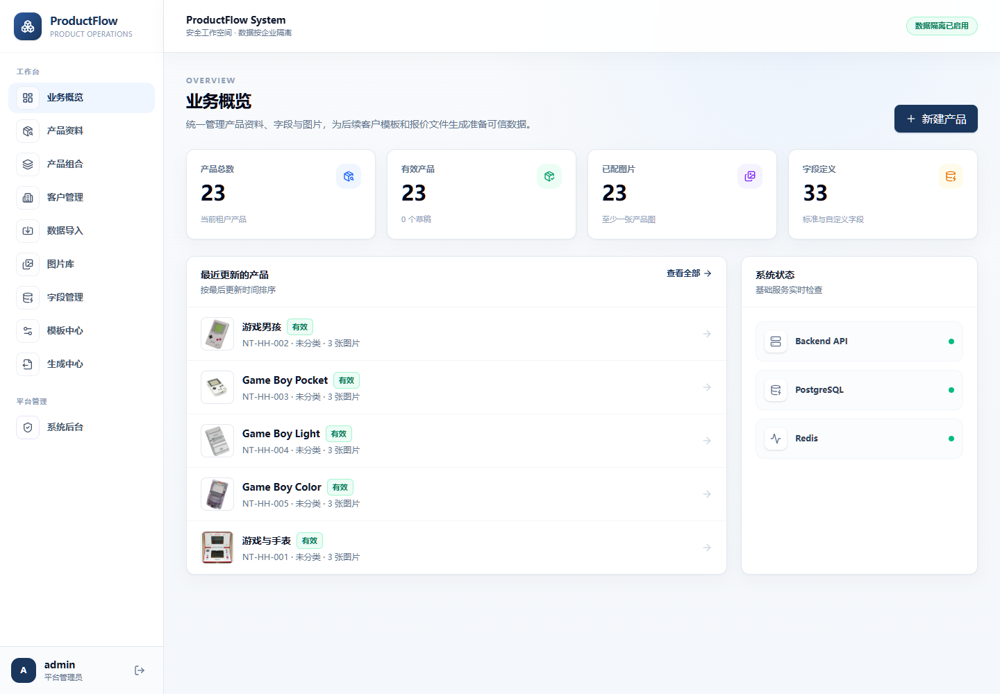
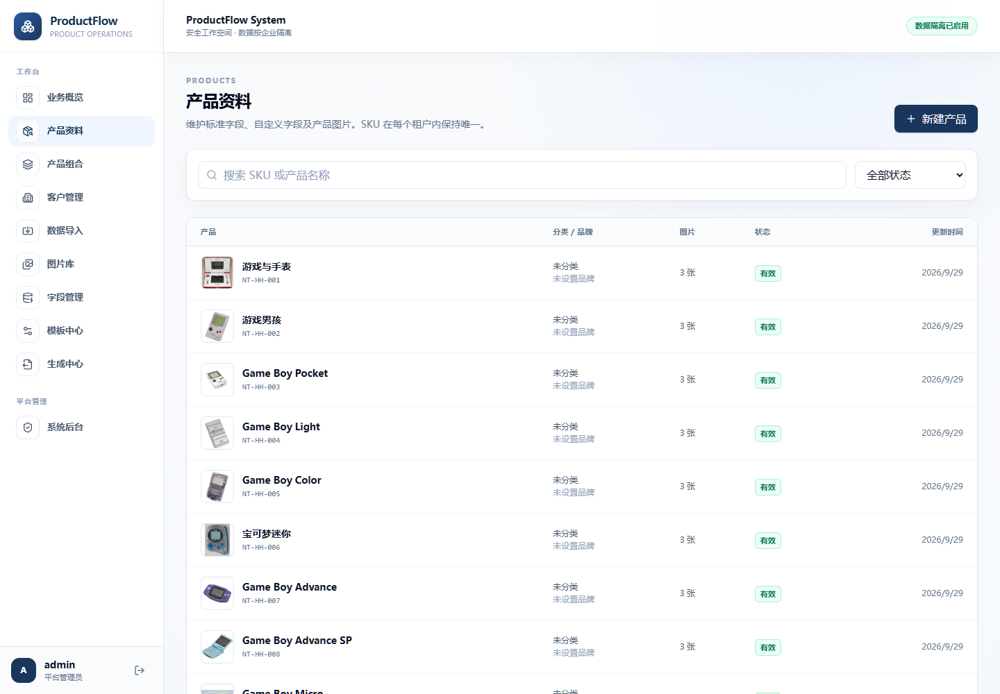

<div align="center">

# ProductFlow · 产品资料与报价工作台

**多租户产品资料管理、客户组合与可编辑报价文件生成平台**

[](https://react.dev/)
[](https://fastapi.tiangolo.com/)
[](https://www.docker.com/)

</div>

ProductFlow 面向外贸业务团队：将供应商 Excel 与嵌入图片导入标准产品资料库，按客户维护产品组合和模板，并输出原生可编辑的 PPTX/XLSX 文件或可离线交付的精品 HTML 报价单。

> 当前为 MVP：核心流程已经实现，审计整改与真实业务模板验收仍在进行中。

## 真实界面截图

以下均为 ProductFlow 实际运行界面截图，展示的游戏机产品资料为项目演示数据；不包含登录界面或账号信息。

<p align="center"></p>

<p align="center"></p>

## 核心能力

- 多租户注册、登录、角色控制与 PostgreSQL RLS 数据隔离。
- 产品、图片、自定义字段及内部字段/客户字段隔离；分类与品牌使用租户级字典，可筛选、复用并在保存产品时自动扩充。
- 上传图片保留原文件，同时自动识别边缘白底、生成裁切后的透明 PNG；PPTX/XLSX/HTML 附件输出优先使用透明衍生图。
- Excel 导入：字段映射、说明行忽略、重复 SKU 策略、图片匹配与置信度审计。
- 客户、产品组合、导入模板和输出模板管理。
- PPTX/XLSX 模板解析、字段/图片映射与 SHA-256 指纹验证。
- 原生可编辑的 PPTX/XLSX 报价文件生成，以及可追溯的不可变 Generation Snapshot。
- 可扩展多币种报价：报价币种支持同时多选，默认 USD；演示数据分别保留日本首发价与美国首发 MSRP，HTML、PPTX、XLSX 只输出每个产品实际有值的所选币种，历史任务固化完整币种列表和对应金额。
- 三套内置高级 HTML 报价模板：Editorial Luxury、Curated Journey、Bold Energy；支持批量选品、三图展示、图片内嵌、打印/PDF 适配和内部字段硬隔离。
- 平台管理员跨租户汇总后台；业务数据保持只读，支持安全重置用户密码并立即撤销该账号的旧登录会话。

## 技术栈

| 层 | 技术 |
| --- | --- |
| 前端 | React 19、TypeScript、Vite、Nginx |
| 后端 | Python 3.12、FastAPI、Uvicorn、Alembic |
| 数据 | PostgreSQL 16、Redis 7.4 |
| 部署 | Docker Compose |
| 输出 | 自包含 HTML、PPTX/XLSX 原生文件 |

## 快速开始

### 前置条件

- Docker Engine 与 Docker Compose
- 私有环境变量文件 `.env`（不要提交）

```bash
cp .env.example .env
# 在 .env 中设置强密码和 JWT_SECRET 后再启动
docker compose up -d --build
```

默认 Web 端口为 `7030`，API 端口为 `8030`。服务状态与健康检查：

```bash
docker compose ps
curl http://localhost:8030/health
```

停止服务并保留数据：

```bash
docker compose down
```

不要在没有完整备份和明确授权的情况下执行 `docker compose down -v`。

## 配置与安全

从 `.env.example` 创建仅保存在本机的 `.env`。部署前必须替换 PostgreSQL 管理账号密码、应用账号密码、JWT 签名密钥和初始管理员密码；任何 `.env`、Token、Cookie、数据库连接串、上传文件或生成的报价文件都不应提交到仓库。

正常业务 API 应使用受 RLS 约束的数据库应用账号。生产环境还应配置真实域名、HTTPS、备份策略和不可变镜像标签。

## 使用流程

1. 上传并分析供应商 Excel，配置字段映射、数据起始行和图片匹配规则。
2. 审核导入预览并选择重复 SKU 策略，将资料写入产品库。
3. 通过分类/品牌字典筛选产品；产品详情可修改品牌，也可直接输入新分类或品牌并自动加入字典。
4. 维护客户、产品组合和客户可见字段。
5. 上传 PPTX/XLSX 输出模板，验证参数化对象并保存字段/图片 Mapping。
6. 勾选一个或多个报价币种（默认 USD）并创建生成任务；系统冻结产品、完整币种列表与对应金额、透明 PNG 图片、客户、组合、模板和参数快照后生成可编辑报价文件。

也可以在生成中心直接使用“精品 HTML 报价单”：从三套内置版式中选择一套，勾选产品、同时选择一个或多个报价币种、填写标题和报价备注后下载单个 `.html` 文件。图片和当次客户可见资料都嵌入文件，不依赖 ProductFlow 登录态；浏览器打开后可直接打印或导出 PDF。默认勾选 USD，且至少保留一个币种。模板会按勾选顺序展示该产品已有的价格；某个币种字段为空时只省略该币种，所有所选币种都为空时才省略该产品的价格模块。系统不会进行汇率换算，也不会回退到其他市场价格。

当前任天堂演示产品的 `price_usd` 是美国市场首发 MSRP，不是由日元换算。Game Boy Light（日本限定）以及没有美国独立标准版首发价的新任天堂 3DS 标准版保持空值；这类产品同时选择 USD 和 JPY 时只展示 JPY。JPY 仍保存日本市场首发价。若要增加 EUR、GBP 等币种，可在字段管理中新建客户可见的金额字段并填写三位 ISO 货币代码；字段代码按 `price_eur`、`price_gbp` 的规则创建后，生成中心会自动增加对应币种复选项。

## Renderer 边界

当前稳定支持：PPT 文本/文本 Run/图片 Shape，以及 XLSX 单元格、合并单元格和图片。DOCX/PDF Renderer、在线 PPT 编辑器、SmartArt、复杂图表、动画、VBA、复杂母版以及动态复制幻灯片/表格行不在当前范围内。

模板文件变更后必须重新验证 Mapping；内部字段不会进入客户输出。被历史生成任务引用的产品或输出模板应归档而不是永久删除。

## 测试

```bash
docker compose --profile test run --rm backend-test pytest -q
docker compose --profile test run --rm frontend-test npm test -- --run
docker compose exec -T backend python -m ruff check app tests
```

## 许可证

本仓库暂未声明开源许可证；未经授权不得复制、分发或用于生产部署。
